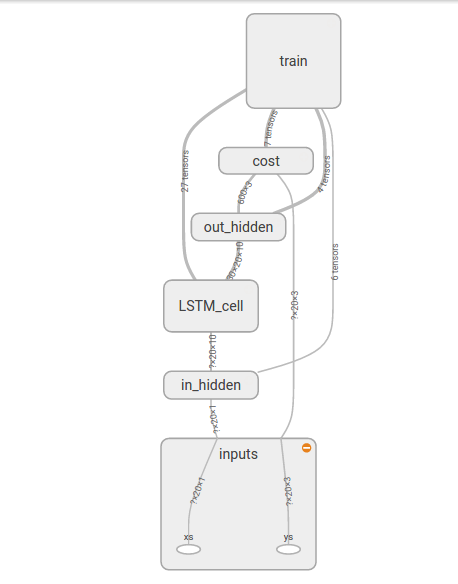
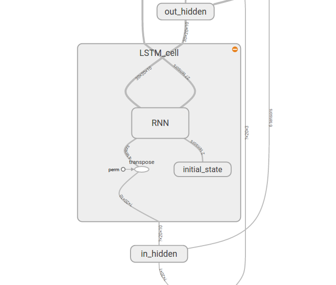
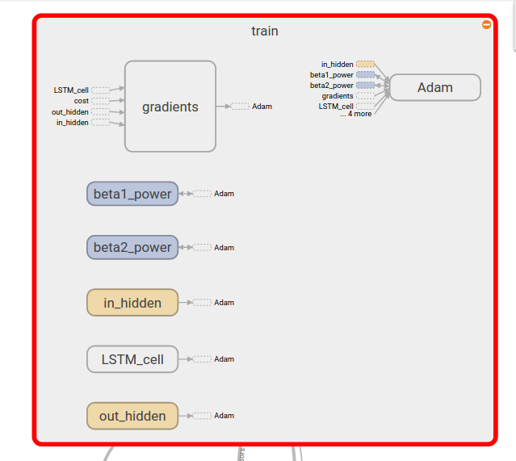

## LSTM Model

An LSTM, or a Long Short Term Memory, is an improved version of a Recurrent Neural Network to incorporate better learning & memory with time. In this model, I plan to use a time series of the various job running times to predict the upcoming job times with a certain guaranteed accuracy. The beauty of the LSTM learns job dependencies on its own, by a framework very similar to a deep neural network.

### Current Model
_(The sample model has 4 jobs with linear dependencies.)_
The current model looks like the graph given below.  
  

The input consists of the timings of the first job, with the hyperparameter `TIME_STEPS = 20`. That is visible as `xs`. `ys` is maintained for training as the times for the other jobs.  
The learning is accredited to the LSTM cell, as shown below.  
  

At the end of this, we have the `state` of the model, of other parameters. When predicting, we use the input as well as the state to predict using the model. A great feature of the model is that we can even predict the future set of events pretty nicely. This means that given the input of the current set of job times, it can be trained to predict the job timings of the future `n` runs, where n can be as high as 4-5 (_as per my observations on the dataset_).  
A drawback that I see, as of now, is that there is no direct accommodation for job failure as an event. The current plan discussed includes replacing every failed event with an event with a _very high_ completion time, which for all practical purposes will work well with the model.  
The parameters and hyperparameters available for tuning include the optimiser, learning rate, momentum, hidden layer, cost, amongst others. These strongly depend on the nature of the data, and although I have tuned them for best performance on the dummy, it requires some effort in the future.  
  

_That is all I could think of right now. Sorry to have missed any details._

### Coming Up!

Next up is tweaking the model so that input can be `n` units, where n is the number of jobs in the graph. This would give a kind of `n*n` linkage, and surely be more accurate, reliable and responsive than the current model. Given the structure of my code, it should not be too tough to extend this without altering the class structure much. This should boost the performance much more, and maybe predict better links.
